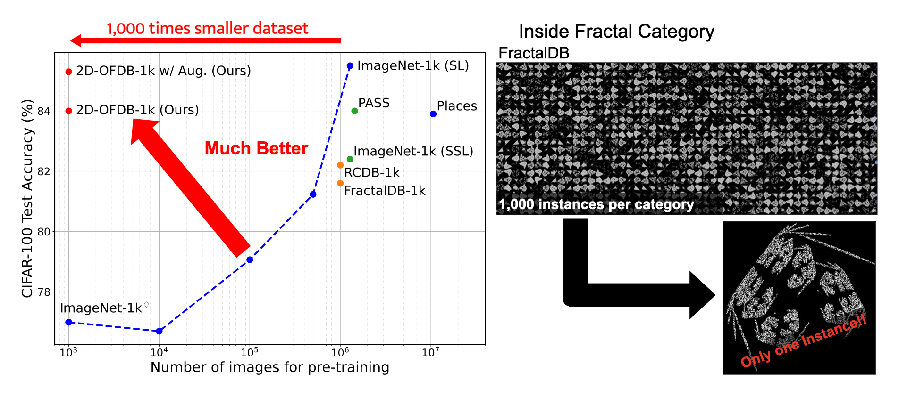

## Background: Pre-training

**From Supervised to Self-Supervised to Synthetic**

**Supervised Learning (SL)**

- ImageNet-1k, Places-365
- Human-provided labels
- Licensing and bias concerns

**Self-Supervised Learning (SSL)**

- DINO, MAE, MoCo
- No human labels needed
- Still requires large real datasets

**Synthetic Pre-training (FDSL)**

- Formula-Driven Supervised Learning
- No real images or human labels
- Generated images + automatic labels

---

## Background: Related work #1 - FractalDB

[Pre-training without Natural Images](https://arxiv.org/abs/2101.08515)

Million-scale synthetic dataset using fractals (FractalDB)

- 1M synthetic images from fractal formulas
- 1k categories with 1k images each
- Performance comparable to ImageNet-1k

---

## Background: Related work #2 - OFDB

[Pre-training Vision Transformers with Very Limited Synthesized Images](https://arxiv.org/abs/2307.14710)

One-instance Fractal Database (OFDB)

- 1k categories with 1 image each
- Performance equal or better than FractalDB
- 1M → 1k images

