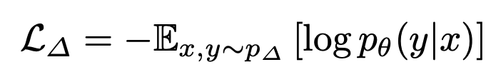
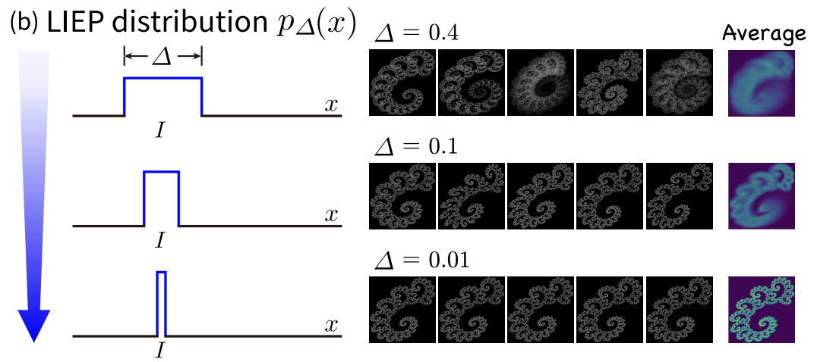

## Method: 1p-frac

**1-parameter fractal**

We want to pre-train with a single fractal image.

But with one image and one label, we learn a trivial solution (training collapses):
$$ p\_\\theta(y=0|x) \\equiv 1 \\quad \\forall x $$

Solution: Introduce controlled perturbations

---

## Method: The LIEP Distribution

**Locally Integrated Empirical Perturbation**

Instead of using the single image directly, they create a distribution around it:

$$ p_\Delta(x, y) = \frac{1}{R_\Delta} \int_{R_\Delta} \delta(x - I_{\pmb{\epsilon}}) \delta(y - \pmb{\epsilon}) d\pmb{\epsilon} $$

where:

- $ I\_{\pmb{\epsilon}} $ is the perturbed version of the original image $ I $
- $ \pmb{\epsilon} $ is a small perturbation vector
- $ R\_{\Delta} $ is region of possible perturbations (like a hypercube(?))
- Each perturbation $ \pmb{\epsilon} $ becomes its own "class"
- As $ \Delta \to 0 $, we approach single image case

---

## Method: LPCE Loss

Locally Perturbed Cross Entropy

where $ p\_\Delta(x, y) $ is the LIEP distribution we defined earlier.

(I believe this is just a fancy way of saying normal cross entropy)

---

## Method: Perturbation

**How you perturb the fractal?**

Original affine transformation used to generate the fractal:

$$ w_j(\\pmb{v}) = \\begin{bmatrix} a_j & b_j \\\\ c_j & d_j \\end{bmatrix} \pmb{v} + \\begin{bmatrix} e_j \\\\ f_j \\end{bmatrix} $$

Perturbed transformation:

$$ w_j(\pmb{v}; \pmb{\\epsilon}\_j) = \\left(\\begin{bmatrix} a_j & b_j & e_j \\\\ c_j & d_j & f_j \\end{bmatrix} + \pmb{\\epsilon}\_j\\right) \\begin{bmatrix} \pmb{v} \\\\ 1 \\end{bmatrix} $$

Where $\pmb{\\epsilon}_j \\in [-\\Delta/2, \\Delta/2]^{6j}$

---

## Method: Visualization of "Invisible" Differences

Perturbations "imperceptible" to humans

We end up with meaningful learning from "meaningless" differences
