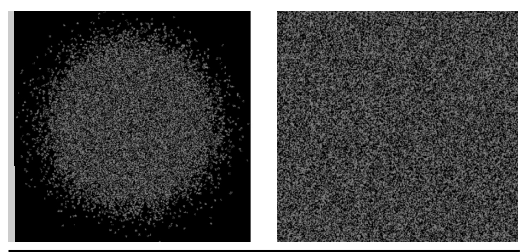

## Experiments: Exploration Study - 1p-frac vs Baselines

ViT-Tiny, data augmentation based on DeiT, 1k samples

| Method      | #Images | CIFAR-100 | ImageNet-100 |
| ----------- | ------- | --------- | ------------ |
| Scratch     | -       | 64.2%     | 74.9%        |
| FractalDB   | 1M      | 81.6%     | 88.5%        |
| OFDB        | 1k      | 84.0%     | 88.6%        |
| **1p-frac** | **1**   | **84.2%** | **89.0%**    |

Single fractal outperforms larger datasets!

---

## Experiments: Scaling Study - ImageNet-1k Fine-tuning

ViT-Base, data augmentation based on DeiT, 21k samples

| Pre-training Dataset | #Images | Type          | ImageNet-1k Acc |
| -------------------- | ------- | ------------- | --------------- |
| Scratch              | -       | -             | 79.8%           |
| ImageNet-21k         | 14M     | Real          | 81.8%           |
| FractalDB-21k        | 21M     | Synthetic     | 81.8%           |
| **1p-frac**          | **1**   | **Synthetic** | **82.1%**       |

Single fractal beats 14M real images!

They keep the same fine-tuning protocols as used for the original Imagenet-21k to ImageNet-1k transfer, putting them at a potential disadvantage.

---

## Experiments: Using Random Noise

ViT-Tiny, data augmentation based on DeiT

| Method                | CIFAR-100 | ImageNet-100 |
| --------------------- | --------- | ------------ |
| Gaussian noise + LPCE | 1.1%      | 5.7%         |
| Uniform noise + LPCE  | 2.0%      | 71.1%        |
| **1p-frac + LPCE**    | **84.2%** | **89.0%**    |

Not any perturbation works - need structured patterns like fractals

---

## Experiments: Hyperparameter Study

Finding a sweet spot for perturbation size $\Delta$

ViT-Tiny, data augmentation based on DeiT

| $\\Delta$ | CIFAR-100 | ImageNet-100 |
| --------- | --------- | ------------ |
| 0.001     | 1.2%      | 1.9%         |
| 0.01      | 19.9%     | 61.8%        |
| 0.05      | 83.0%     | 88.2%        |
| **0.1**   | **84.2%** | **89.0%**    |
| 0.2       | 83.4%     | 88.5%        |

Need sufficient perturbation, but not too much
