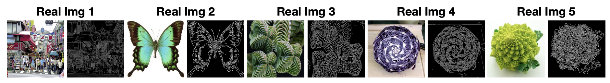
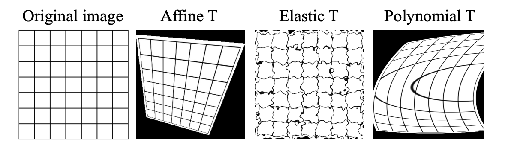
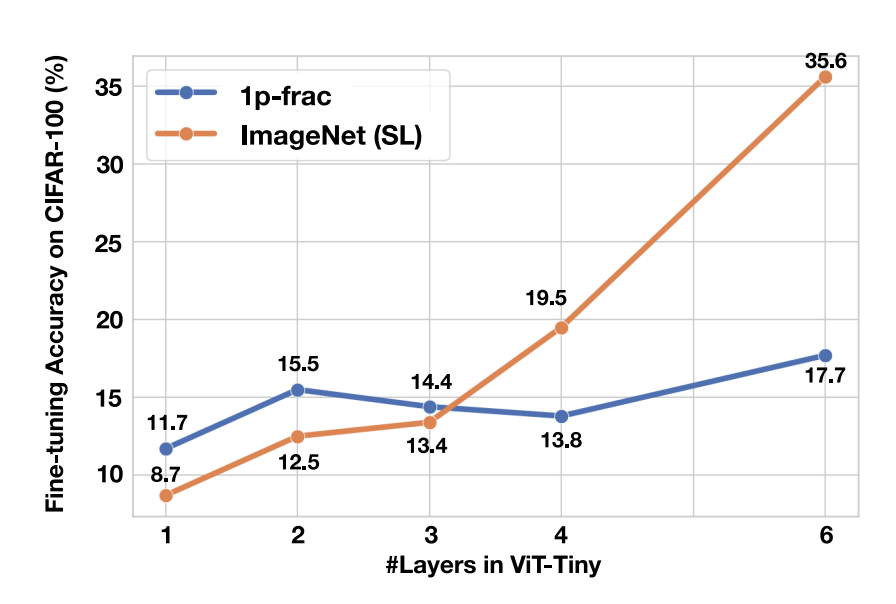

## Experiments: Ablation Study - Data Augmentation

Ablation study on CIFAR-100 with ViT-Tiny

| Removed Augmentation | Accuracy Drop              |
| -------------------- | -------------------------- |
| Baseline             | 84.2%                      |
| w/o Random Crop      | **-4.1%**                  |
| w/o Mixup + Cutmix   | **-3.8%**                  |
| w/o Random Augment   | -0.8%                      |
| w/o Color Jittering  | -0.0%                      |

Spatial transformations crucial, color less important

---

## Experiments: Ablation Study - Using Real Images

Can we scale backwards with real images too?

Experiment with single real image + shape augmentation + LPCE loss

**Image preprocessing comparison:**

- RGB images: 81.6% accuracy
- **Canny edge images: 82.2%**

**Transformation comparison:**

- **Affine transformations: 81.9%**
- Polynomial transformations: 81.3%
- Elastic transformations: 37.0%

Edge-emphasized + affine transforms ≈ fractal classification

---

## Experiments: Linear Probing

ViT-Tiny, CIFAR-100

- 1p-frac learns better low-level features
- Early layers can be frozen after 1p-frac pre-training
- Challenges assumption that real images needed for basic features
